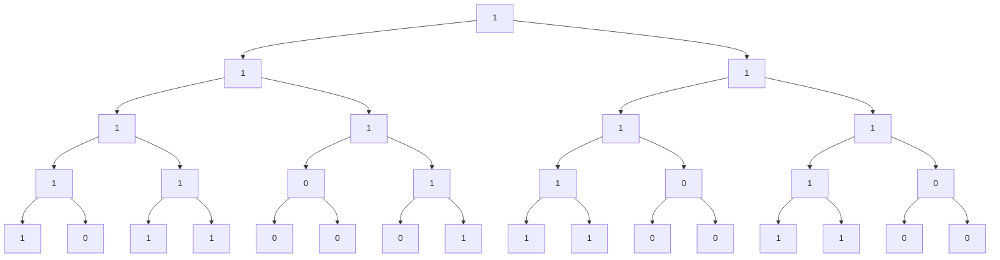
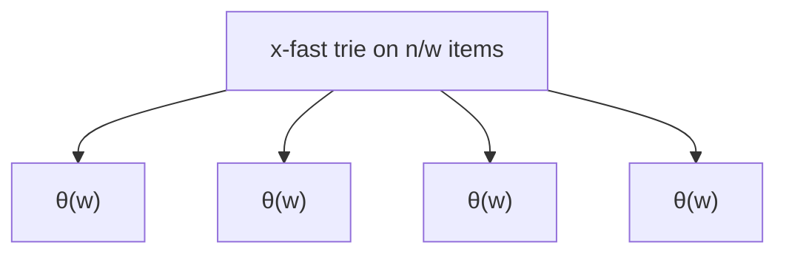
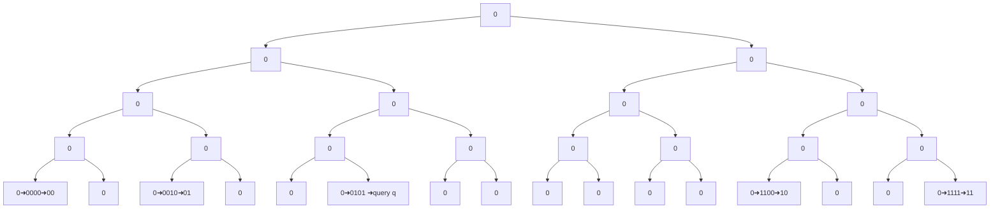

# Intro
 SCRIBING 10%.<br>
 P sets 60%.<br>
 Final Project 30%.<br>

- Goals: 
  - Increased ability to analyze and algorithms.
  - Looking at different models within which to analyze algorithms.

 ## Word RAM Model
never faster than nlog(n)<br>

 ### Static predecessor
 - data structure represents set S of items {x<sub>1</sub>,...x<sub>n</sub>}
 - Query perd(x)=max{x∈S:x<z};predecessor of z is the maximum of x and S
 - want low space, fast query
 - Stative vs Dynamic: no insertion in static; dynamic allows insertions
 - Binary search tree.
   + Example solution: Store numbers sorted, do binary search(static)
   +  O(lgn) dynamic query using balanced BST
   + Comparison-based sorting
  
 ### Word RAM Model
never faster than nlog(n)
 - items are integers in {0,1,...,2^w-1}
 - w="word size", u=2^w-1
 - also assume that pointers fit in a word
 - space>=n
 - w>= lg(space)>=lgn.

### Two data structures
1. Van Emde Boos tree (FOCS 1975), Reference(...):
    - update /query: θ($\log w$) time, θ(u) space(can be made θ(n) w/randomization
    - yfast tries: same bounds
2. Fuston trees (Fredman, Willard Jcss 1993)
    - query in time: θ($\log_w n$)time.
   ➜ achieve min{log w$ , $\log_w n$} <= $O(\sqrt{\log n})$.
   ➜ (w/ dynamic fusion trees) $O(\sqrt{n})$ sorting.
   - Faster sorting
      + $O(lg lg n)$ delete. (Itan, STOC 2002)
      + $O(\sqrt{lg lg n})$ random time (Han,Thomp FOCS 2002)
    
 ### Word RAM Model (continue)
 Assume that given x,y fitting in a word each, we can do:<br>
     + / * - ~ ^ | $ >>  <<   in constant time.<br>
 
 
 ## Van Emde Boos tree (vEB tree)
 vEB tree defined recursively
  - Triangle vEB_u tree bottom has $\sqrt{n}$ vEB_($\sqrt{n}$), the top have one vEB_(\sqrt{n}) and one minimum element in the tip<br>
 <!--图片 -->
Fields of vEB_u (V)<br>
 - (\sqrt{n}) site array V.cluster[0], ..., V.cluster[($\sqrt{n}$)-1] for  V.cluster[] means for vEB(\sqrt{u}) data structure
 - V.summary is a vEB(\sqrt{u}) instance
 - V.min/V.max are integers in {0,...,u-1}
 - x∈{0,...,u-1},
 - Write x in binary x=10010011, where 1001 is c and 001 is i, then x=<c,i>, c,i∈{0,...,u-1},
 - How to do a query for x? 按位与和位移运算在常数时间提取c, i
 - How to search for the predecessor of x in this recursive data structure?
 - 1) Insert i into the cluster c； if the c cluster happened to be empty, insert c into the summary. The summary keeps track of which is non-empty.
 - 2) Look for the minimum element in c cluster; if mine is bigger, then my predecessor lives in the same cluster. Therefore, recursively do a predecessor in i cluster; <br> if it is empty or bigger than or equal to min, then my predecessor does not live in the same cluster, it lives in the largest cluster before me that is non-empty. Therefore, do a predecessor in c cluster in the summary and return a max in that cluster.

``` C
pred (V, x=<c,i>)
if x > V.max: return V.amx
else if V.cluster[c].min< x:
    return pred(V.cluster[c],i)
else:
    c'=pred(V.summary,c)
   return V.cluster[c'].max
```
for this, only have one recursive call:<br> 
pred time T(u)=T($\sqrt{n}$)+O(1).<br> 
         ➜T(u)=O(lg lg u)
``` python
insert(V,x=<c,i>)
if v=∅：
    V.min∈x', return
if x< V.min:
    swap(x,V.min)
if V.cluster[c].min=∅
    insert(V.summary,c)
insert(V.cluster[c].i)
```
insertion time T(u)<= 2*T($\sqrt{u}$)+O(1)<br>
               T(w)<= 2*T(w/2)+O(1).<br>
 However, 2 is too pessimistic:<br>
               T(u)<= 1*T $\sqrt{u}$+O(1)<br>
               T(w)<= 1*T(w/2)+O(1)<br>
                ➜T(u)=O(lg lg u)<br>

### Space of vEB
S(u)=($\sqrt{u}$+1)+ $O(1)$<br> 
➜S(u)=θ(u)<br> 
Improve space in a vEB data structure, have a hash table
 - keys are cluster Id's c,
 - value is a pointer to the corresponding non-empty cluster

+ Claim vEB w/ hash table uses θ(u) space
Pf: charge the cost of storing (c, piomter to cluster c) to the minimum element of cluster c. Each x∈Sis change exactly once.<br> 
(short aside)<br> 
### Dictionary problem
 - store (key, value)
 - query(k) returns val associated w/ key k( or null if k is not associated
 - insert(k,v) associates vak v w/ key k
 - Dynamic diction is possible w/ θ(n) space, θ(l) wprst case query, θ(l) constant expected insertion (with high possbility)

Another solution bit array of legth u

| 1 | 0 | 1 | 1 | 0 | 0 | 0 | 1 | 1 | 1 | 0 | 0 | 1 | 1 | 0 | 0 |
|---|---|---|---|---|---|---|---|---|---|---|---|---|---|---|---|
| 0 | 1 | 2 | 3 | 4 | 5 | 6 | 7 | 8 | 9 | 10 | 11 | 12 | 13 | 14 | 15 |


- store all the 1's in a doubly linked list
- running time is log(u)
- On any leaf-to-root path, the bits are monotone
- store tree as an array root at index 0. Node v has left child at 2v+1, and right child at 2v+2.<br> This implies we can find the kth ancestor in constant time by doing >>k
- could also, for each node, store its 2^k th ancestor for each k, where k: 0, lglgu

## Y-fast tries
- To save space, only store the 1's in a hash table
- For each level of tree, hash table store localtion of 1's.<br> 
   space θ(nw) (x-fast tries)
- from x-fast to y-fast:
    + use "indirection":
    + each "θ(w)" uses a balanced binary search tree BST to store
    + each "θ(w)" contains somethere b/w, w/2 and 2w items

linear space and search time is still lglg u

# Fusion trees 
(Fredman, Willard JCSS 1993)
- static dynamic by (Andersson- Thorup JACM 2007):  $O((\log_w n)+lglgn)$ updates
- by (Raman ESA 1996): $O(\log_w n)$ updates （expected time）
- Query for all, $O(\log_w n)$

### Fusion tree
 <!--图片 -->
- this basic structure with <br>
$\Theta(w^{1/5})$
 <br>keys per node, where w is the machine word size (e.g., 64 bits).
- height is
  <br> $θ(\log_{w^(1/5)} n)$  <br>
  = $O((\lg n)/(1/5 \lg w))$  <br>
  = $O(\log_w n)$
- Basic issue: How do we search a single fusion tree node in constant time?
  + Basic ingredient；
    1. multiplication
    2. sketchcompression
    3. word-level parallelism (parallel comparison)
    4. the most significant set bit (MSB) in θ1 time
- Let's focus on representing a single fusion tree node containing $x_0$ < $x_1$ < ...< $x_{k-1}$
- Let r<k be the # of branch bits; Let their indices be b_0 < b_1 < ... < b_(r-1)
- sketch sk(x) as keeping only the x_bi sk(|0111010)=11
- each x_1 has sk(x_i) tking r=$O(w^(1/5))$ bits<br> 
 ➜ can store all sk(x_i) in k*r=$O(w^(3/5))$ bits<br>

- Suppose sk(q) lies b(u) sk(x_i) and sk(x_i+1)
- Let y be the first node where q falls off the highlighted paths
- If q falls off to the right, set e=y 011...1<br> 
   ➜ o/w if q falls to the left, let e=y| 0...1<br>
- Claim: If we see where sk(e) fits amongst the sk(xi) that is the same as where q fits amongst the X_i
- pf Exercise: To find y, compute MSB(x_i  ^q) and MSB(x_i+1  ^q)<br> and take the more sig. bit b/w the two<br> 

Problem: How do we from sketches?
- we will compress down to $O(r^(4))$ bits
- the important bit will be represented, <br>
w/ some known amount O-soacing w b/w them
